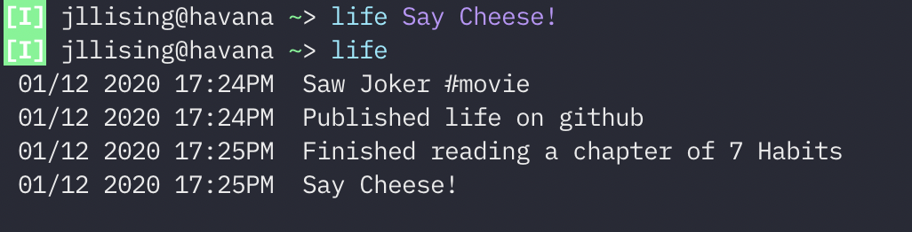

# life

Life is a simple command-line application to keep track of life's events.

# Features
- Keep track of your life with micro bloggin
- Read and Append only. Mistakes are a part of life.
- Cross-platform.
- Small terminal friendly 100 width

# Usage

`$ life`

Displays all of the _life_ entries in reverse chronological order (latest at the bottom)

`$ life "My businesss was sold for $100,000 USD!"`

Will add the entry to the life log.

# Your life log

Your _.life_ database can be found in `$HOME/.life`

# Install

`go get github.com/jg-l/life`

# Tricks

## Tag and Filter entries using grep

- Add a hashtag or any symbol
`$ life "Meditated for 50 minutes! #spiritual"`

- Filter life log using grep
`$ life | grep "#spiritual"`

# Future features (probably not...)
- [x] Remove boltdb big boy dependencies!
- [ ] Filter entries based on date ranges
- [ ] Colorize output! 
